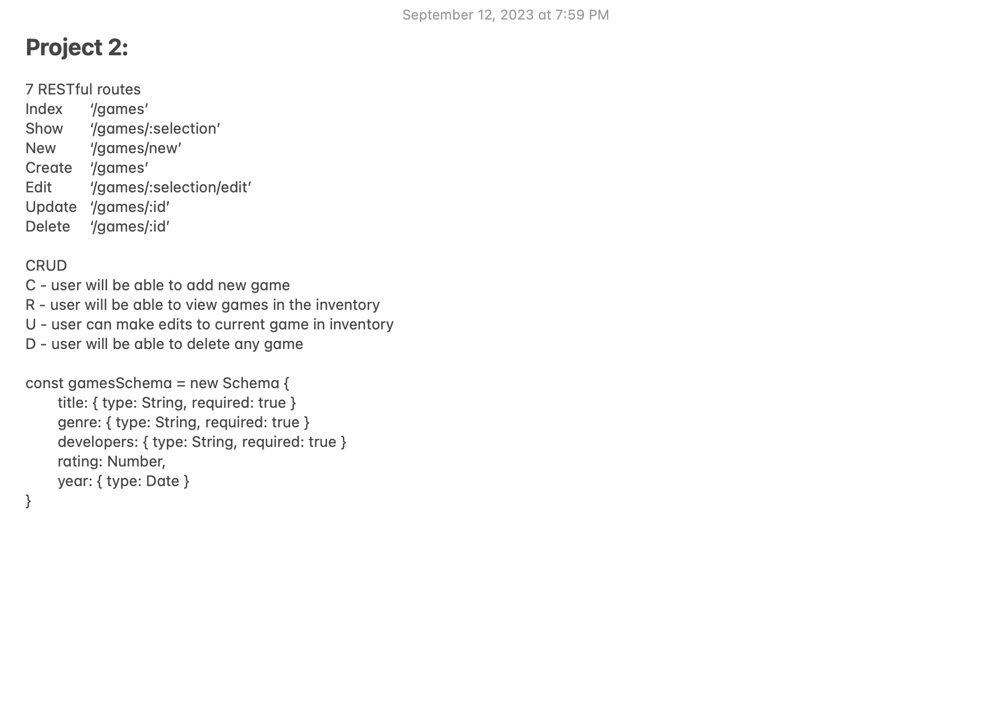

Wireframes:

Project Summary:
Retro Games is a webpage for SNES super fans! This page allows user to search and find classic SNES games. Users also have the ability to add some of their favorite games to the collection.

Technologies Used:
- Node.js: Server found on local terminal, which utilizes javascript.
- Express.js: Allows the development of web applications, by the management of servers and routes.
- MongoDB: It is a database manager.
- Mongoose: Is used  accompanying mongodb, which can query and manipulate the database.
- EJS: (embedded javascript) allows users to render images or functions, using javascsript code, in html.
- MVC structure: Model, View and Controller file structure are used to orangize codes.
- dotenv: .env is an npm packages used to create custom environment files.
- method-override: A function that accompanies DELETE or PUT route because urls can only read GET or POST routes. method-override, overrides this limitations to allow users to be able to delete. 
- .gitignore: Hides unnecessary files.
- partials: Partials are a way to limit reductant coding but creating a short-hand code that can be used mutiple times, in substitution for long hand codes. 
- HTML/CSS: Are files that allows develops to structure and design their codes.
- Heroku: Is a web based deployment application. 

User Stories:
- User selects console of choice to find desired game
- User searches for desired games with console library
- User selects game to view game info: title, image, genre, developer, rating, and year
- CRUD 
-- User will be able to add new game
-- User will be able to view games in inventory
-- User can make edits to current game inventory
-- User will be able to delete any game

Stretch Goals:
- Incorporate purchase function.
- Ability for users to create logins with suser authenication and authorization.
